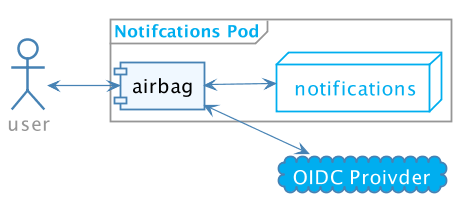

<link rel="stylesheet" type="text/css" href="./soluto.css" />

<!-- .slide: data-background="#ffffff" data-state="soluto" -->
# Not my problem!
###  Delegating respobisiblites to infrastrucutre 
 

Yshay Yaacobi

@yshayy

---

<!-- .slide: data-background="#ffffff" data-state="soluto" -->
 

 As a developer, I want to  focus on building features that deliver  business value .
 

---

<!-- .slide: data-background="#eeeeee" data-state="soluto" -->
## Infrastructure

---

<!-- .slide: data-background="#ffffff" data-state="soluto" -->

Monolith 
---------→
Microservices

---

<!-- .slide: data-background="#ffffff" data-transition="fade" data-state="soluto"  -->

### Few Monoliths

Monolith #1 

Monolith #2 

Monolith #3 

---

<!-- .slide: data-background="#ffffff" data-transition="fade" data-state="soluto" -->

### Few Monoliths

Application code

Infra code 

Application code

Infra code 

Application code

Infra code 

---

<!-- .slide: data-background="#ffffff" data-transition="fade" data-state="soluto" -->

Monoliths ----→ Lots of Microservices

---

<!-- .slide: data-background="#ffffff" data-transition="fade" data-state="soluto" -->

Monoliths ----→ Lots of Microservices

---

<!-- .slide: data-background="#ffffff" data-transition="fade" data-state="soluto" -->
### Service structure

----→

Infra-code and business logic code live together with every microservice

---

<!-- .slide: data-background="#ffffff" data-transition="fade" data-state="soluto" -->
### Service structure

----→

Can we write only our business code and let our hosting environment take care of the rest?

---

<!-- .slide: data-background="#ffffff" data-transition="fade" data-state="soluto" -->

## About me

Yshay Yaacobi

@yshayy

* Tech lead @ Soluto
* Open source
* Cloud architecture
* Functional Programming
* Docker
* Code Quality

---

<!-- .slide: data-background="#ffffff" data-transition="fade" data-state="soluto" -->

## About Soluto

* Based in Tel Aviv, acquired by Asurion at 2013
* Next generation of tech support
* 150M worldwide users
* We love open-source

---

<!-- .slide: data-background="#ffffff" data-transition="fade" data-state="soluto" -->

---

<!-- .slide: data-background="#ffffff" data-transition="fade" data-state="soluto" -->

## Shifting to microservices

* ~5 services -> 100+ services
* Cultural change, new aspects of ownership
* CI/CD - Better tooling automation

---

<!-- .slide: data-background="#ffffff" data-transition="fade" data-state="soluto" -->

# How does a service look like?

---

<!-- .slide: data-background="#ffffff" data-transition="fade" data-state="soluto" -->

### DEMO - Notifications service V1

---

<!-- .slide: data-background="#ffffff" data-transition="fade" data-state="soluto" -->

## Spec - Notifications service

* We want to send notifications for users
* Notifications will be based on templates
* Notifications will be personalized

---

## Flow - Notification service

1. Get user identifier and notification type
* Fetch user details from users micro-service
* Format message using a template
* Send a message

---

## Let's write some code

---

# Demo

---

☐ Logging  

☒ ???????  
☒ ???????????  
☒ ???????????

---

## Logging

* We need to add a logger
* We send logs to a 3rd party provider
* Let's get a library + a provider

---

☑ Logging  
☐ Resiliency  

☒ ???????  
☒ ???????????

---

## Resiliency

* The network can fail
* We want to retry failed requests
* Let's add Polly

---

☑ Logging  
☑ Resiliency  
☐ Authentication

☐ ???????????

---

## Authentication

* We'll use JWT token
* OIDC/OAuth2

---

<!-- Add business monitoring -->
<!-- Add metrics -->

☑ Logging  
☑ Resiliency  
☑ Authentication  
☐ Monitoring

---

## Monitoring

* Performance metrics, throughput, latency
* Statsd client

---

☑ Logging  
☑ Resiliency  
☑ Authentication  
☑ Monitoring

---

# Let's get rid of stuff

---

# Logging Revisited

---

## Logging

* Use log collector
* Scrape the logs from Docker

---

## FluentD

* Run on every node (Daemonset)
* Declarative configuration to define log pipelines

---

## Logging - extra benefits

* Different policies
* Info/Debug  -> low retention 
* Error/Fatal  -> high retention 

---

<s>☑ Logging  </s>    
☑ Resiliency  
☑ Authentication  
☑ Monitoring

---

# Resiliency Revisited

---

## Resiliency

* Service-mesh, THE buzzword for 2018
* Istio
* Injects proxy sidecar

---

## Service mesh - Istio 

---

## Service mesh - Resiliency 

* Configurable failure handling

---

## Service mesh extra benefits

* Security
* Traffic management
* Tracing
* Too many to count...

---

<s>☑ Logging</s>  
<s>☑ Resiliency</s>  
☑ Authentication  
☑ Monitoring

---

# Authentication Revisited

---

## Authentication

* Let's use a sidecar
* Soluto/Airbag

---

## Authentication - Airbag

---

## Authentication - Airbag

* Configuration yaml example
* Open source
* Probably be superseded by   Istio's origin authentication

---

<s>☑ Logging</s>   
<s>☑ Resiliency</s>   
<s>☑ Authentication</s>  
☑ Monitoring  

---

# Monitoring

---

## Monitoring

---

<s>☑ Logging</s>  
<s>☑ Resiliency</s>  
<s>☑ Authentication</s>  
<s>☑ Monitoring</s>

---

##  A new requirement

* Sending lots of messages
* Batch process 

---

## Previous solution

---

## Yet Another sidecar 

---

## Dequeue Daemon Sidecar 

* Soluto/DQD
* Read items from queue, activate service
* Back-pressure support
* Expose consumption metrics

---

## DQD - Demo

---

## DQD - benefits

* Scaled with service
* Trusted
* Agnostic 
* Testing
