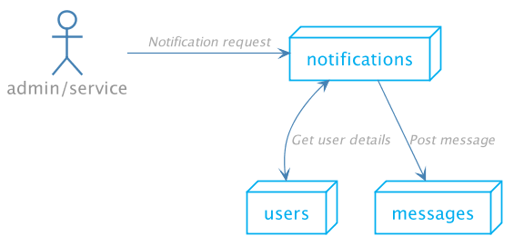
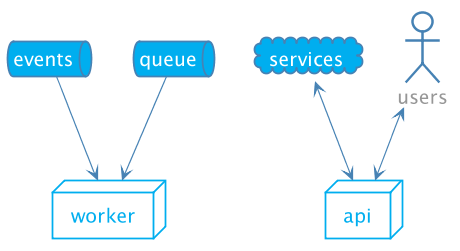

<link rel="stylesheet" type="text/css" href="./soluto.css" />

<!-- .slide: data-background="#ffffff" data-state="soluto" -->
# Not my problem!
###  Delegating respobisiblites to infrastrucutre 
 

Yshay Yaacobi

@yshayy

https://git.io/fxh57

---

<!-- .slide: data-background="#ffffff" data-state="soluto" -->
 

 As a developer, I want to  focus on building features that deliver  business value .
 

---

<!-- .slide: data-background="#eeeeee" data-state="soluto" -->
## Infrastructure

---

<!-- .slide: data-background="#ffffff" data-state="soluto" -->

Monolith 
---------→
Microservices

---

<!-- .slide: data-background="#ffffff" data-transition="fade" data-state="soluto"  -->

### Few Monoliths

Monolith #1 

Monolith #2 

Monolith #3 

---

<!-- .slide: data-background="#ffffff" data-transition="fade" data-state="soluto" -->

### Few Monoliths

Application code

Infra code 

Application code

Infra code 

Application code

Infra code 

---

<!-- .slide: data-background="#ffffff" data-transition="fade" data-state="soluto" -->

Monoliths ----→ Lots of Microservices

---

<!-- .slide: data-background="#ffffff" data-transition="fade" data-state="soluto" -->

Monoliths ----→ Lots of Microservices

---

<!-- .slide: data-background="#ffffff" data-transition="fade" data-state="soluto" -->
### Service structure

----→

Infra-code and business logic code live together with every microservice

---

<!-- .slide: data-background="#ffffff" data-transition="fade" data-state="soluto" -->
### Service structure

----→

Can we write only our business code and let our hosting environment take care of the rest?

---

<!-- .slide: data-background="#ffffff" data-state="soluto" -->

## About me

Yshay Yaacobi

@yshayy

* Tech lead @ Soluto
* Open source
* Cloud architecture
* Functional Programming
* Docker
* Code Quality

---

<!-- .slide: data-background="#ffffff" data-state="soluto" -->

## About Soluto

* Based in Tel Aviv, acquired by Asurion at 2013
* Next generation of tech support
* 150M users worldwide
* We love open-source

---

<!-- .slide: data-background="#ffffff" data-state="soluto" -->

---

<!-- .slide: data-background="#ffffff" data-state="soluto" -->

## Shifting to microservices

* ~5 services -> 100+ services
* Cultural change, new aspects of ownership
* CI/CD - Better tooling automation

---

<!-- .slide: data-background="#ffffff" data-state="soluto" -->

# How does a service look like?

---

<!-- .slide: data-background="#ffffff" data-state="soluto" -->

### DEMO - Notifications service V1

---

<!-- .slide: data-background="#ffffff" data-state="soluto" -->

## Spec - Notifications service

* We want to send notifications to users
* Notifications will be based in templates
* Notifications will be personalized

---

<!-- .slide: data-background="#ffffff" data-state="soluto" -->

## Flow - Notification service

1. Get user identifier and notification type
* Fetch user details from users micro-service
* Format message using a template
* Send a message

---

<!-- .slide: data-background="#ffffff" data-state="soluto" -->

## Let's write some code

---

# Demo

---

<!-- .slide: data-background="#ffffff" data-state="soluto" -->

## What's missing?

- Visibility  
- Security  
- Resiliency  

---

<!-- .slide: data-background="#ffffff" data-state="soluto" -->

## Logging

* We need to add a logger
* We send logs to a 3rd party provider
* Let's get a library + a provider

---

<!-- .slide: data-background="#ffffff" data-state="soluto" -->

☑ Logging  
☐ Error policies  

☐ Authentication  
☐ Monitoring

---

<!-- .slide: data-background="#ffffff" data-state="soluto" -->

## Error policies

* The network can fail
* We want to retry failed requests
* Let's add Polly

---

<!-- .slide: data-background="#ffffff" data-state="soluto" -->

☑ Logging  
☑ Error policies  
☐ Authentication

☐ Monitoring

---

<!-- .slide: data-background="#ffffff" data-state="soluto" -->

## Authentication

* We'll use JWT token
* OIDC/OAuth2

---

<!-- .slide: data-background="#ffffff" data-state="soluto" -->
<!-- Add business monitoring -->
<!-- Add metrics -->

☑ Logging  
☑ Error policies  
☑ Authentication  
☐ Monitoring

---

<!-- .slide: data-background="#ffffff" data-state="soluto" -->

## Monitoring

* Performance metrics, throughput, latency
* Statsd client

---

<!-- .slide: data-background="#ffffff" data-state="soluto" -->

☑ Logging  
☑ Error policies  
☑ Authentication  
☑ Monitoring

---

# Demo

---

<!-- .slide: data-background="#ffffff" data-transition="fade" data-state="soluto" -->

### What just happend here?

We wanted a small micro service and got a bunch of code and dependencies

---

<!-- .slide: data-background="#ffffff" data-transition="fade" data-state="soluto" -->

### What just happend here?

4 X Lines of codes !!!  
3 X Direct dependencies !!!

---

<!-- .slide: data-background="#ffffff" data-state="soluto" -->

### Soluto - microservices v1

* Shared template - dependencies and code blocks
* Used by teams as a boilerplate
* Shared “common” packages/frameworks
* Lots of DI magic
* Worked well until...

---

<!-- .slide: data-background="#ffffff" data-state="soluto" -->

### Problems

* Upgrades are **Hard**
* Dependencies can break
* Dependencies can conflict
* Dependencies requires re-build+re-deploy
* Extremely difficult to introduce global change

---

<!-- .slide: data-background="#ffffff" data-state="soluto" -->

## And that's not the worse...

---

<!-- .slide: data-background="#ffffff" data-state="soluto" -->

### We need to solve it for each and every programming language

---

<!-- .slide: data-background="#ffffff" data-state="soluto" -->

### Not all languages are born equal

---

<!-- .slide: data-background="#ffffff" data-state="soluto" -->
 

 As a developer, I want to  focus on building features that deliver  business value .
 

---

<!-- .slide: data-background="#ffffff" data-state="soluto" -->
 

 Which of these concerns can be solved at  environment level  ?
 

---

<!-- .slide: data-background="#ffffff" data-state="soluto" -->

### Soluto - microservices v2

 + 

---

<!-- .slide: data-background="#ffffff" data-state="soluto" -->

### Kubernetes

* Orchestrate our services
* Solves many cross cutting concerns

---

<!-- .slide: data-background="#ffffff" data-state="soluto" -->

### A **Sidecar** Container

* Additonal Container in a **pod**
* Provide **functionality**   to support main app
* **Co-scheduled** together in   replicas

---

<!-- .slide: data-background="#ffffff" data-state="soluto" -->

### Sidecars can help us solve infrastructure concerns **externally** to our app

---

# Let's get rid of stuff

---

<!-- .slide: data-background="#ffffff" data-state="soluto" -->

# Logging Revisited

---

<!-- .slide: data-background="#ffffff" data-state="soluto" -->

## Logging

* Use log forwarder
* Scrape the logs from Docker

---

<!-- .slide: data-background="#ffffff" data-state="soluto" -->

## FluentD

* Run on every node (Daemonset)
* Declarative configuration to define log pipelines

---

<!-- .slide: data-background="#ffffff" data-state="soluto" -->

## Logging - extra benefits

* Different policies
* Info/Debug  -> low retention 
* Error/Fatal  -> high retention 
* Plugins -> anonymization

---

<!-- .slide: data-background="#ffffff" data-state="soluto" -->

<s>☑ Logging  </s>    
☑ Error policies  
☑ Authentication  
☑ Monitoring

---

<!-- .slide: data-background="#ffffff" data-state="soluto" -->

# Error policies Revisited

---

<!-- .slide: data-background="#ffffff" data-state="soluto" -->

## Error policies

* Service-mesh, THE buzzword for 2018
* Istio
* Injects proxy sidecar

---

<!-- .slide: data-background="#ffffff" data-state="soluto" -->

## Service mesh - Istio 

---

<!-- .slide: data-background="#ffffff" data-state="soluto" -->

## Service mesh - Resiliency 

* Configurable failure handling

---

<!-- .slide: data-background="#ffffff" data-state="soluto" -->

## Service mesh extra benefits

* Security
* Traffic management
* Tracing
* Too many to count...

---

<!-- .slide: data-background="#ffffff" data-state="soluto" -->

<s>☑ Logging</s>  
<s>☑ Error recovery</s>  
☑ Authentication  
☑ Monitoring

---

<!-- .slide: data-background="#ffffff" data-state="soluto" -->

# Authentication Revisited

---

<!-- .slide: data-background="#ffffff" data-state="soluto" -->

## Authentication

* Let's use a sidecar
* Soluto/Airbag

---

<!-- .slide: data-background="#ffffff" data-state="soluto" -->

## Authentication - Airbag

---

<!-- .slide: data-background="#ffffff" data-state="soluto" -->

## Authentication - Airbag

* Configuration yaml example
* Open source
* Probably be superseded by   Istio's origin authentication

---

<!-- .slide: data-background="#ffffff" data-state="soluto" -->

<s>☑ Logging</s>   
<s>☑ Resiliency</s>   
<s>☑ Authentication</s>  
☑ Monitoring  

---

<!-- .slide: data-background="#ffffff" data-state="soluto" -->

# Monitoring

---

<!-- .slide: data-background="#ffffff" data-state="soluto" -->

## Monitoring

---

<s>☑ Logging</s>  
<s>☑ Resiliency</s>  
<s>☑ Authentication</s>  
<s>☑ Monitoring</s>

---

<!-- .slide: data-background="#ffffff" data-state="soluto" -->

##  A new requirement

* Sending lots of messages
* Batch process 

---

<!-- .slide: data-background="#ffffff" data-state="soluto" -->

## Previous solutions

---

<!-- .slide: data-background="#ffffff" data-state="soluto" -->

## Yet Another sidecar 

---

<!-- .slide: data-background="#ffffff" data-state="soluto" -->

## Dequeue Daemon Sidecar 

* Soluto/DQD
* Read items from queue, activate service
* Back-pressure support
* Expose consumption metrics

---

## DQD - Demo

---

<!-- .slide: data-background="#ffffff" data-state="soluto" -->

## DQD - benefits

* Scaled with service
* Testing
* Agnostic 

---

<!-- .slide: data-background="#ffffff" data-state="soluto" -->

### Second iteration

* Lots of code elimination
* Dependencies removal
* Leaner, more testable service
* Declarative approach
* Better visibility

---

### Architecture

<!-- .slide: data-background="#ffffff" data-state="soluto" -->

* External processes
* **Agents & Proxies**
* Co-scheduling

---

<!-- .slide: data-background="#ffffff" data-state="soluto" -->

### How far can we go?

* **Gateways** - routing, caching, validation, rate limiting, policies
* **Configuration** - secrets, cloud resource binding
* **Tools** - remote debugging/profiling
Supporting services - analytics, feature flags, etc…
* **Probably more**… (https://landscape.cncf.io/)

---

<!-- .slide: data-background="#ffffff" data-state="soluto" -->

### How did it **affect** us?
* Cleaner, leaner services
* Testing got easier
* Faster adoptions of new languages and tools
* No more Soluto.Logging/Monitoring/Auth/... packages
* We're still learning...

---

<!-- .slide: data-background="#ffffff" data-state="soluto" -->
 

 As a developer, I want to  focus on building features that deliver  business value .
 

---

<!-- .slide: data-background="#ffffff" data-state="soluto" -->

# What can the infrastructure do for you?

---

<!-- .slide: data-background="#ffffff" data-state="soluto" -->

## Thank you

---

<!-- .slide: data-background="#ffffff" data-state="soluto" -->

## Questions

---

<!-- .slide: data-background="#ffffff" data-state="soluto" -->

### Additonal resources - tools

* AirBag - github.com/soluto/airbag 
* DQD - github.com/soluto/dqd
* FluentD - https://www.fluentd.org/
* Prometheus - https://prometheus.io
* Istio - https://istio.io/
* Skaffold - github.com/GoogleContainerTools/skaffold
* Oidc-server-mock - github.com/Soluto/oidc-server-mock
* FluentD k8s level filter - github.com/Soluto/fluent-plugin-kubernetes-log-level

---

<!-- .slide: data-background="#ffffff" data-state="soluto" -->

### Additonal resources

<ul>
<li>CNCF landscape - https://landscape.cncf.io/ </li>
<li>
Design patterns for container-based distributed systems - https://static.googleusercontent.com/media/research.google.com/en//pubs/archive/45406.pdf
</li>
<li>
Introduction to modern network load balancing and proxying - https://blog.envoyproxy.io/introduction-to-modern-network-load-balancing-and-proxying-a57f6ff80236
</li>
</ul>

