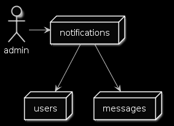

# Let's start

---

## Notification micro-service

* Get user identifier and message type
* Fetch user details from users micro-service
* Format message using a template
* Send a message

---

---

## Let's write some code

---

# Coding...

---

# Demo

---

# What about Logging?

---

## Logging

* We need to add a logger
* We send logs to a 3rd party provider
* Let's get a library + a provider

---

# What about Resiliency?

---

## Resiliency

* The network can failed
* We want to retry failed requests
* Let's add Polly

---

# What about AuthN/Z?

---

## AuthN/Z

* We'll use JWT token
* Add picture

---

# What about Monitoring?

---

## Monitoring

* Performance metrics, throughput, latency
* Statsd client
