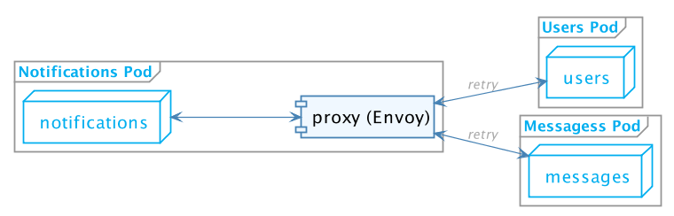

# Let's get rid of stuff

---

### Visualizing our environment

---

# Logging Revisited

---

## Logging

* Use log collector
* Scrape the logs from Docker

---

## FluentD

* Run on every node (Daemonset)
* Declarative configuration to define logs pipelines

---

## Logging - extra benefits

* Different policies - low/high retention

---

# Resiliency Revisited

---

## Resiliency

* Service-mesh, THE buzzword for 2018
* Istio
* Injects envoy sidecar

---

## Resiliency - Istio 

---

## Resiliency - Istio 

* Configurable failure handling
* Not currently deployed at Soluto

---

## Service mesh extra benefits

* Tracing
* Traffic management
* Too many to count...

---

# AuthN/Z Revisited

---

## AuthN/Z

* Let's use a sidecar
* Soluto/Airbag

---

## AuthN/Z - Airbag

--- 

## AuthN/Z - Airbag

* Configuration yaml example

---

# Monitoring

---

##  And there's a bonus

---

## What if we want to batch send messages?

---

## Previous solution

---

## Yet Another sidecar 

---

## Dequeue Daemon Sidecar 

* Soluto/DQD
* Read items from queue, activate service
* Back-pressure support

---

## DQD - benefits

* Scaled with service
* Trusted
* Agnostic 

---

## DQD - Demo